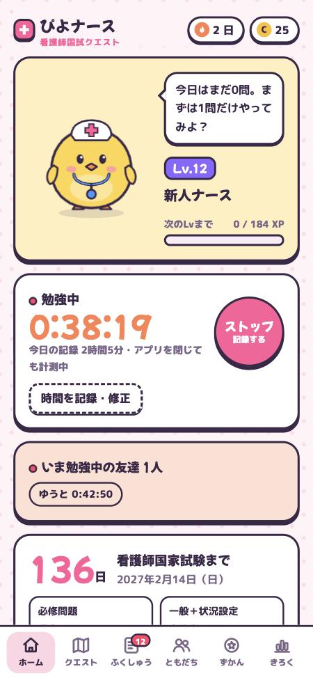
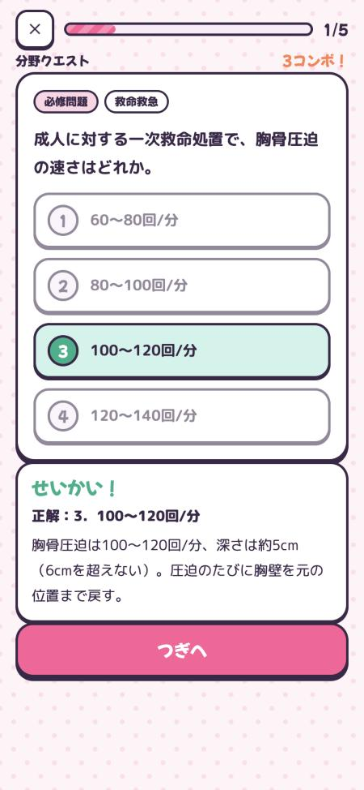
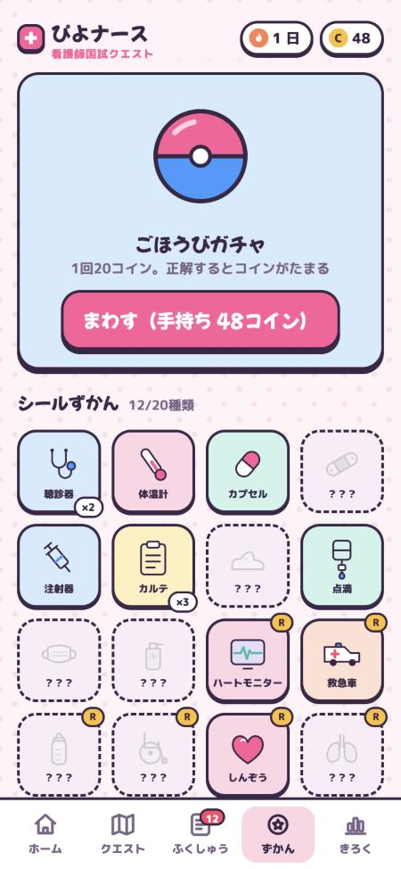

# 🐣 ぴよナース国試クエスト

ひよこのナース「ぴよナース」を育てながら、看護師国家試験の勉強ができるゲームアプリです。
スマホでもパソコンでも、ブラウザで開くだけですぐに遊べます。登録やインストールは不要で、無料です。

### ▶ [アプリを開く](https://daichi001100.github.io/piyo-nurse/)

  
  
  

## こんなアプリです

- 1回5問から遊べるので、すきま時間に少しずつ進められます
- 正解すると経験値（XP）がたまり、ぴよナースが「たまご」から「レジェンドナース」まで8段階に成長します
- 間違えた問題は「間違いノート」に自動でたまり、そのまま復習リストになります
- 第116回看護師国家試験（2027年2月14日）までの残り日数と、合格ラインまでの距離を表示します

## あそべるモード

| モード | 内容 |
| --- | --- |
| おまかせ10問 | まだ解いていない問題と、間違えた問題を優先して10問出題 |
| 分野クエスト | 12分野から選んで5問。正解済みの割合に応じて★が1〜3個つく |
| 必修チャレンジ | 必修問題10問。8問正解（8割）で合格 |
| タイムアタック | 60秒で何問正解できるかに挑戦 |
| サバイバル | ハート3つからスタートし、間違えるたびに1つ減る |
| 状況設定バトル | 患者さんの事例を読んで3問に答える（1問2点）。正解すると患者さんの元気ゲージが上がる |
| 計算ドリル | 点滴の滴下数（成人用・小児用）、輸液ポンプの流量、薬液量、消毒液の希釈、酸素ボンベの使用可能時間、BMI。毎回数値が変わる |
| ミニ模試 | 必修10問＋一般15問＋状況設定2ケース（計31問）。本番の合格基準と同じ比率で合否を判定 |
| 間違いノート | 間違えた問題だけを復習。2回続けて正解すると卒業 |

## 収録問題

問題と解説はすべてオリジナルです。令和5年版「保健師助産師看護師国家試験出題基準」の科目に沿って作成しています。

| 分野 | 問題数 |
| --- | ---: |
| 必修問題 | 25 |
| 人体の構造と機能 | 14 |
| 疾病の成り立ちと回復の促進 | 15 |
| 健康支援と社会保障制度 | 12 |
| 基礎看護学 | 14 |
| 成人看護学 | 15 |
| 老年看護学 | 14 |
| 小児看護学 | 13 |
| 母性看護学 | 13 |
| 精神看護学 | 12 |
| 地域・在宅看護論 | 11 |
| 看護の統合と実践 | 11 |
| 状況設定問題 | 8ケース（24問） |
| **合計** | **193問**＋計算ドリル（自動生成） |

## ぴよナースの成長

| レベル | ランク |
| --- | --- |
| Lv.1 | たまご |
| Lv.3 | ひよっこ看護学生 |
| Lv.6 | 実習がんばり中 |
| Lv.10 | 新人ナース |
| Lv.15 | 先輩ナース |
| Lv.20 | 主任ナース |
| Lv.30 | 看護師長 |
| Lv.40 | レジェンドナース |

## ごほうび

- **コイン**：1問正解ごとに1枚。高得点のボーナスで5枚、ミッション達成で10枚もらえます
- **ごほうびガチャ**：20コインで1回。聴診器やナースキャップなど、看護グッズのシールが全20種類（ノーマル・レア・スーパーレア）
- **バッジ**：「1週間皆勤」「コンボ10」「ミニ模試合格」など全14種類
- **きょうのミッション**：毎日3つ（10問解く・5問連続正解・計算ドリルか状況設定に挑戦）

## 合格ラインについて

- **必修問題**：50点中40点以上（8割・絶対基準）
- **一般問題＋状況設定問題**：第115回（2026年）は249点中166点以上。毎年変わる相対基準です
- 「きろく」タブでは、いまの正答率から本番で取れそうな点数を推定して表示します

試験日と合格基準は、厚生労働省の発表をもとに記載しています。

## 記録の保存について

- 学習の記録は、アプリを開いたブラウザの中（localStorage）だけに保存されます。サーバーには送信されません
- ブラウザのデータを削除したり、別の端末やブラウザで開いたりすると、記録は引き継がれません
- スマホではホーム画面に追加すると、アプリのように開けて便利です
  - **iPhone**：Safariで開き、共有ボタン →「ホーム画面に追加」
  - **Android**：Chromeで開き、右上のメニュー →「ホーム画面に追加」

## ご注意

- 問題と解説はすべてオリジナルで、実際の国家試験問題ではありません
- 医療・看護の内容は、教科書や最新のガイドラインでもあわせて確認してください
- 厚生労働省や試験の実施機関とは関係のない、個人制作の学習アプリです

## ファイル構成

| ファイル | 内容 |
| --- | --- |
| `index.html` | アプリ本体（HTML・CSS・JavaScript・問題データを1つのファイルにまとめたもの） |
| `screenshot-*.jpg` | このREADMEに載せている画面写真 |

外部ライブラリは使っていません（フォントのみ Google Fonts を読み込み）。GitHub Pages でそのまま公開できます。
